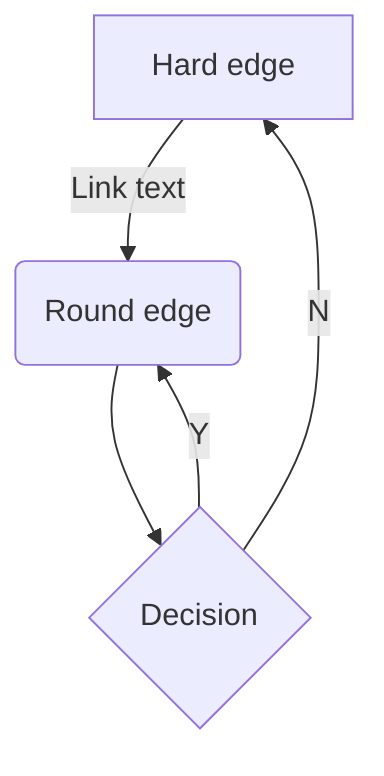
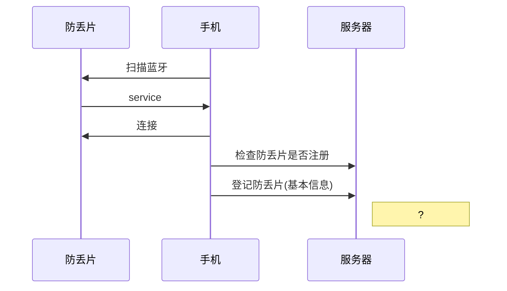
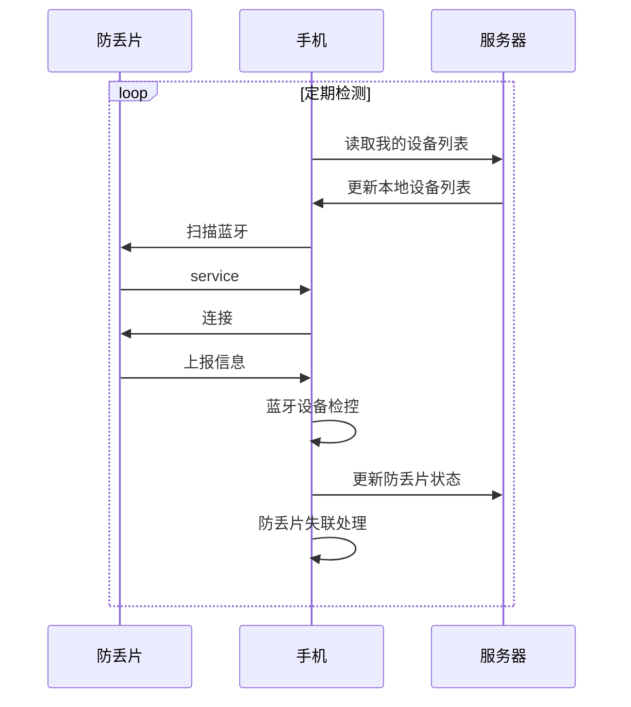
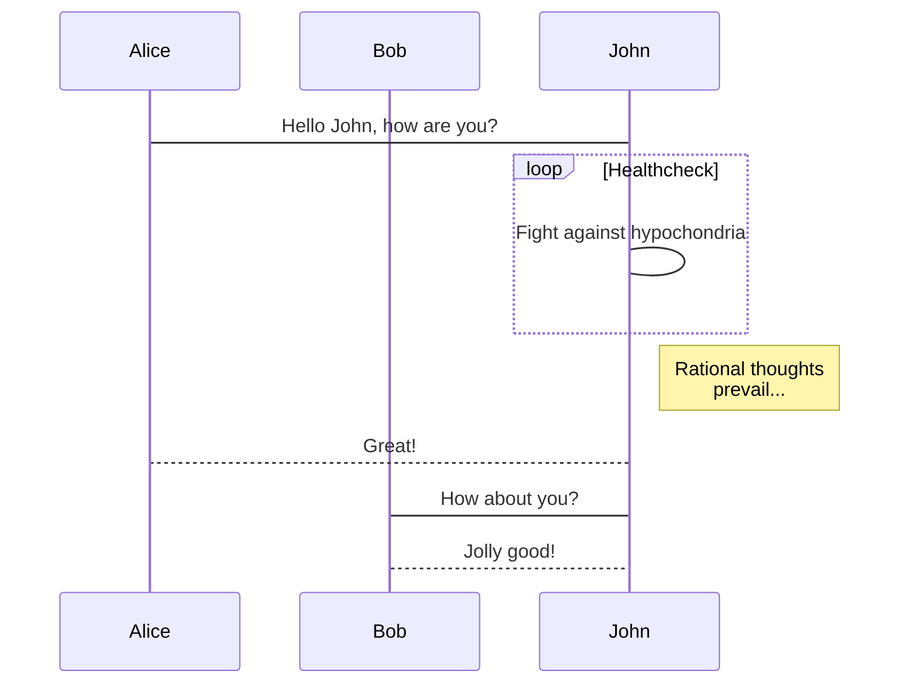
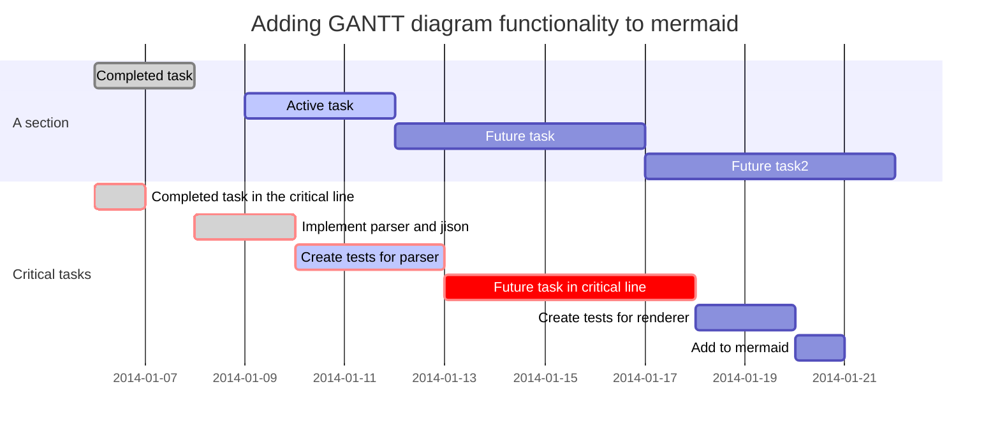
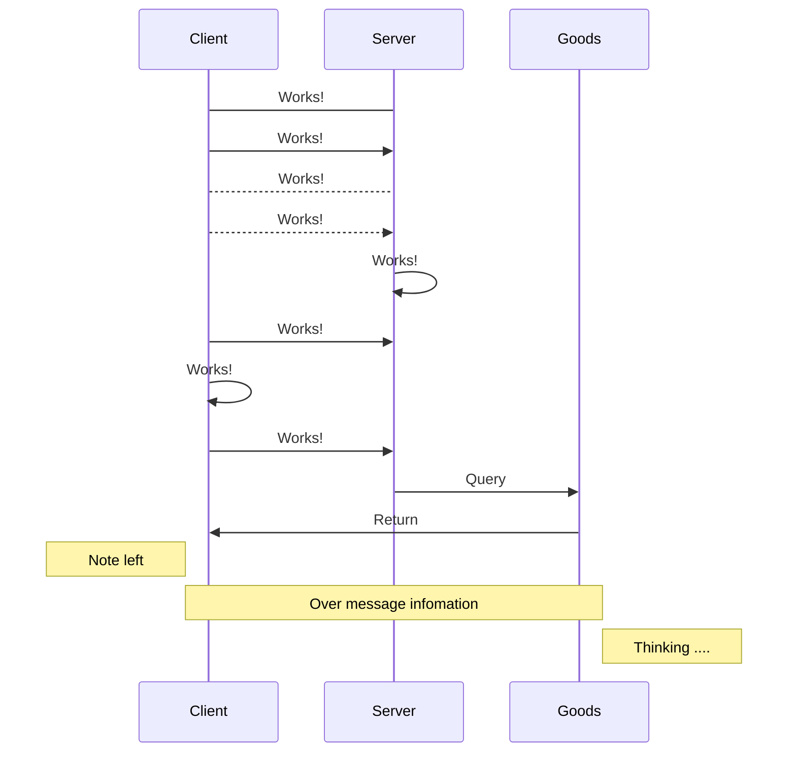
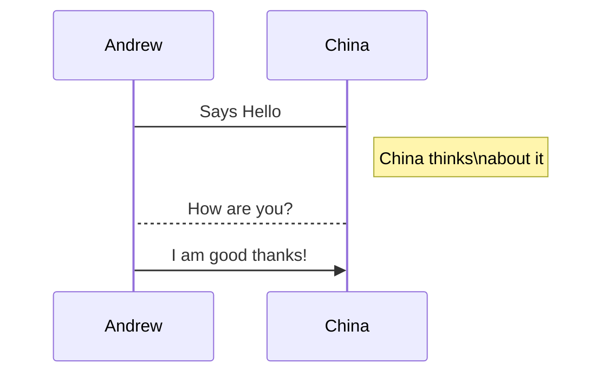

# Title
<!-- TOC -->

- [Title](#title)
    - [aaa](#aaa)
        - [CC](#cc)
- [](#)
- [](#-1)

<!-- /TOC -->

## aaa
### CC

>$${\bold e}_\alpha = \begin{pmatrix}\cos\alpha\\ \sin\alpha\end{pmatrix}$$  

##

$$a{\bold e}_\alpha + b{\bold e}_\alpha + ce_x=0$$
##

 > $$e^2 = \sqrt{a^2+b^2}$$ (2)













```mermaid
graph
A->B;
B->C;
```

